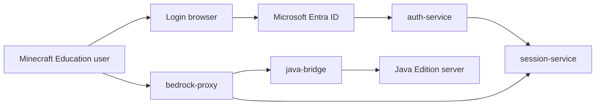

# Architecture

## Overview

This project is intended to work as a controlled bridge between Minecraft Education clients and a Java Edition server. Authentication is handled outside the game protocol through Microsoft Entra ID, and the game connection is authorized with a short-lived participation ID.



## Authentication

Use Microsoft Entra ID with OpenID Connect.

Required validation:

- The ID token signature is valid.
- `aud` matches the application client ID.
- `iss` and `tid` belong to an allowed tenant.
- The account has an expected school or organization tenant context.
- Optional group or role claims match the server access policy.

The application should not collect Microsoft passwords directly and should not clone Microsoft login screens. The browser must be redirected to Microsoft's hosted authentication endpoint.

## Participation ID

A participation ID authorizes game access after the Microsoft login completes.

Recommended fields:

- `participation_id`: Random opaque identifier.
- `tenant_id`: Microsoft tenant ID.
- `issuer_user_id`: User object ID that created the session.
- `allowed_server`: Java server target or server group.
- `expires_at`: Short expiration timestamp.
- `max_uses`: Optional participant limit.
- `revoked_at`: Optional revocation timestamp.

The participation ID should be stored server-side. Clients should only receive the opaque ID, not signed Microsoft tokens.

## Tenant Sharing Rule

When a user submits a participation ID, the service validates both the participation record and the joining user.

Access is granted only if:

- The session exists and is not expired or revoked.
- The joining user authenticated with Microsoft Entra ID.
- The joining user's `tenant_id` equals the session `tenant_id`.
- The target server requested by the client matches the session policy.

## Java Server Identity

There are three viable models.

1. Online-mode Java account login:
   Requires each player to have a valid Java/Minecraft account. This is the strictest model but does not match most Education-only users.

2. Floodgate-style offline identity:
   The proxy maps Education users to stable Java-compatible UUIDs. The Java server must trust the proxy and use compatible plugins or configuration.

3. Dedicated server plugin:
   A custom Java server plugin verifies proxy-signed player metadata and enforces tenant policy inside the server.

For an Education-focused deployment, the second or third model is the practical default.

## Security Requirements

- Bind each session to a tenant and target server.
- Use HTTPS for login and session APIs.
- Hash participation IDs at rest.
- Log session creation, joining, expiry, and revocation.
- Rate-limit session validation and login callbacks.
- Provide an immediate revocation path for administrators.

## Minimal Milestone Plan

1. Implement a Paper plugin gate that can run beside Geyser/Floodgate.
2. Add local session creation, lookup, expiry, and revocation for development.
3. Build `auth-service` with Microsoft Entra ID login and tenant allow-list validation.
4. Integrate an existing Geyser-compatible protocol bridge or fork point.
5. Add Java server identity mapping and admin policy controls.

## Current Plugin Milestone

The first code milestone is `GeyserEduGate`, available as both a Paper plugin and a Fabric server mod that run on the Java server with Geyser/Floodgate.

Commands:

- `/edu-session issue <tenantId> [ttlMinutes]`: Issue a local development session.
- chat participation ID input: Claim a participation ID as the current player. The message is intercepted and not broadcast.
- `/edu-session revoke <participationId>`: Revoke a participation ID.
- `/edu-session list`: List active sessions.
- `/edu-session reload`: Reload configuration and sessions.

The plugin currently uses a local `sessions.yml` file. This deliberately keeps the first milestone independent from Microsoft credentials. The next milestone should replace local issuance with an HTTP verifier that receives sessions from the Entra ID-backed auth service.

## Fabric Support

The Fabric module provides the same command and join-gate behavior as the Paper plugin.

- Entrypoint: `dev.sakus.geyseredu.fabric.GeyserEduGateFabricMod`
- Config file: `config/geyser-edu-gate.properties`
- Commands: `/edu-session issue`, `/edu-session revoke`, `/edu-session list`, `/edu-session reload`
- Optional integrations: Geyser Fabric and Floodgate Fabric

The Fabric implementation keeps sessions in memory for the current milestone. Persistent sessions and remote auth-service verification should be implemented in the shared common layer before production use.

## Auth Service

The `auth-service` module provides the first Entra ID-backed participation ID flow.

Endpoints:

- `GET /login`: Redirects to Microsoft Entra ID.
- `GET /callback`: Exchanges the authorization code, validates basic ID token claims, and issues a participation ID.
- `POST /api/participation/verify`: Verifies a participation ID for Paper/Fabric.
- `POST /api/participation/revoke`: Revokes an unconsumed participation ID.

Verifier request:

```json
{
  "participationId": "opaque-id",
  "playerUuid": "minecraft-player-uuid",
  "playerName": "player-name",
  "platform": "paper"
}
```

Verifier response:

```json
{
  "valid": true,
  "tenantId": "entra-tenant-id",
  "subject": "entra-user-object-id",
  "expiresAt": "2026-06-09T00:00:00Z",
  "message": "verified"
}
```

Security status:

- Authorization code exchange is performed server-side.
- Microsoft OpenID metadata and JWKS are fetched server-side.
- The ID token RS256 signature is verified before issuing a participation ID.
- `aud`, `iss`, `tid`, and `exp` are checked before issuing a participation ID.
- Participation verify API can require a shared bearer token.
- Participation tickets are persisted to a local TSV file by default.
- Production deployments use PostgreSQL via `GEYSER_EDU_STORE_BACKEND=postgres`.
- Participation IDs are stored as HMAC-SHA256 hashes, not plaintext.
- Participation tickets are consumed on successful verification.
- Basic rate limiting protects the verify endpoint.
- Audit logging is written to a local TSV file by default.
- HTTPS termination, administrative UI, and external database storage should be added before production deployment.

## Education Compatibility Layer

Education clients often trail regular Bedrock releases and may bundle several Bedrock feature ranges into one Education release. The common module therefore includes an `EducationCompatLayer` that evaluates:

- client source, such as Floodgate or username policy
- optional Bedrock protocol version, when available
- supported Education profiles
- whether to allow, warn, require a session, or deny

This is not yet a full packet translator. Geyser should remain responsible for Bedrock-to-Java protocol translation. The compatibility layer is the policy and routing point where version-specific Education handling can be attached without forking Geyser immediately.
